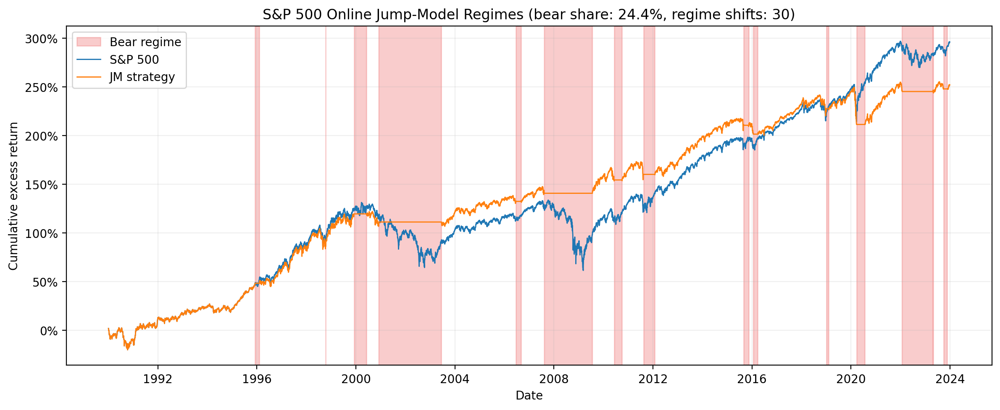

# regimejump

A Python implementation and public-data replication of the statistical jump model in Shu, Yu, and Mulvey (2024), *“Downside risk reduction using regime-switching signals: a statistical jump model approach.”*

The model identifies persistent market regimes by clustering return features while penalizing changes between states.

## Method

For standardized features \(x_t\), the model minimizes

$$
\sum_t \frac{1}{2}\lVert x_t-\theta_{s_t}\rVert^2
+\lambda\sum_{t\geq1}\mathbf{1}\{s_t\neq s_{t-1}\}.
$$

Fitting alternates between:

1. Solving for the optimal state path using dynamic programming.
2. Updating the centroid of each state.

The implementation uses k-means++ initialization, multiple restarts, and an `O(TK)` dynamic-programming recursion.

The paper specification uses three features calculated from daily excess returns:

- EWM downside deviation, half-life 10
- EWM Sortino ratio, half-life 20
- EWM Sortino ratio, half-life 60

## S&P 500 replication

The public-data replication covers 1990–2023 and follows the paper’s main design:

- two market states;
- 3000-day training and inference windows;
- model refitting every six months;
- rolling-DP online inference;
- monthly jump-penalty selection with an eight-year validation window;
- equity exposure in the bull state and Treasury-bill exposure in the bear state;
- two-day signal delay;
- 10 basis-point cost per one-way trade.

### Results

| Metric | Paper B&H | Public B&H | Paper JM | Public JM |
|---|---:|---:|---:|---:|
| Return | 10.20% | 10.21% | 11.20% | 9.72% |
| Volatility | 18.20% | 18.17% | 13.10% | 12.61% |
| Sharpe | 0.48 | 0.48 | 0.68 | 0.59 |
| Maximum drawdown | -55.20% | -55.25% | -26.60% | -33.86% |
| Turnover | 0.00% | 0.00% | 44.00% | 44.13% |
| Equity exposure | 100.00% | 100.00% | 80.00% | 75.56% |

The buy-and-hold results closely match the paper. The jump-model strategy has similar volatility and turnover but lower return and a larger drawdown. Its inferred bear regimes are longer, particularly following the COVID-19 crash.

The original study uses proprietary index and risk-free-rate data. This repository uses Yahoo Finance and FRED, so the results should be interpreted as an approximate methodology replication rather than an exact data replication.



The complete comparison is available in [`results/tables/spx_comparison.csv`](results/tables/spx_comparison.csv).

## Installation

```powershell
python -m venv .venv
.\.venv\Scripts\Activate.ps1
python -m pip install -e ".[dev,data]"
```

## Reproducing the S&P 500 results

Download the public data:

```powershell
python scripts/download_data.py --start 1970-01-01 --end 2024-01-01
```

Generate the features and fixed-penalty regime history:

```powershell
python scripts/run_spx_regimes.py
```

Run monthly penalty selection:

```powershell
python scripts/run_spx_selected_regimes.py
```

Produce the backtest table and figures:

```powershell
python scripts/backtest_spx.py
python scripts/plot_spx_results.py
```

Downloaded data and generated intermediate CSV files are excluded from Git.

## Validation

The dynamic-programming solver is tested against brute-force enumeration. The fitted model and online inference are also tested against the authors’ `jumpmodels` package.

Run the complete test suite and lint checks with:

```powershell
pytest -q
ruff check src tests scripts
```

## References

Shu, Y., Yu, C., & Mulvey, J. M. (2024). Downside risk reduction using regime-switching signals: a statistical jump model approach. *Journal of Asset Management*, 25, 493–507.  
https://doi.org/10.1057/s41260-024-00376-x

Nystrup, P., Lindström, E., & Madsen, H. (2020). Learning hidden Markov models with persistent states by penalizing jumps. *Expert Systems with Applications*, 150, 113307.
https://doi.org/10.1016/j.eswa.2020.113307